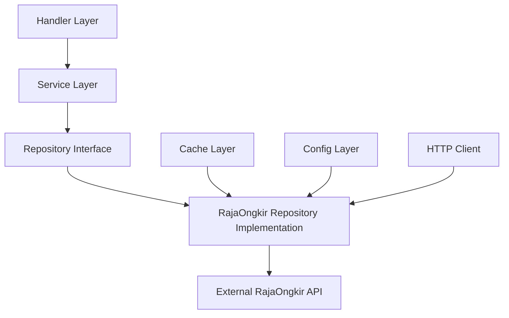

# Technical Specification: Shipping Repository Refactor

## Architecture Overview

### Current Architecture Problems
The current implementation violates clean architecture principles by placing data access logic (`RajaOngkirClient`) in the service layer. This creates several issues:

1. **Separation of Concerns Violation**: Service layer contains HTTP client and external API logic
2. **Testing Complexity**: Business logic and data access logic are intertwined
3. **Limited Extensibility**: Adding caching or alternative providers requires service layer changes
4. **Dependency Direction**: Service depends on concrete implementation rather than abstraction

### Target Architecture



**Note**: Since this service is not yet released, we can implement a direct migration approach without backward compatibility concerns.

## Interface Design

### Repository Interface
```go
// internal/repository/shipping.go
package repository

import "github.com/hanifbg/landing_backend/internal/model/response"

//go:generate mockgen -source=shipping.go -destination=../service/shipping/mocks/shipping_repository_mock.go -package=mocks

type ShippingRepository interface {
    GetProvinces(provinceID string) ([]response.RajaOngkirProvince, error)
    GetCities(provinceID, cityID string) ([]response.RajaOngkirCity, error)
    GetDistricts(cityID string) ([]response.RajaOngkirDistrict, error)
    CalculateShippingCost(origin, destination string, weight int, courier string) ([]response.RajaOngkirCost, error)
}
```

### Repository Implementation Structure
```go
// internal/repository/rajaongkir/client.go
package rajaongkir

type Repository struct {
    apiKey  string
    baseURL string
    client  *http.Client
    cache   cache.Cache // Future: caching layer
    metrics metrics.Recorder // Future: metrics collection
}

func NewRepository(apiKey, baseURL string, options ...Option) *Repository {
    // Implementation with proper configuration and dependency injection
}
```

## Migration Strategy

### Step 1: Create Repository Layer
1. **Create directory structure**:
   ```
   internal/repository/
   ├── shipping.go (interface)
   └── rajaongkir/
       ├── client.go (main implementation)
       ├── client_test.go (unit tests)
       ├── config.go (configuration)
       └── options.go (optional configuration)
   ```

2. **Move and refactor RajaOngkirClient**:
   - Copy current implementation to new location
   - Rename struct to `Repository`
   - Implement `ShippingRepository` interface
   - Add proper error wrapping and logging

3. **Update configuration injection**:
   ```go
   // internal/repository/rajaongkir/config.go
   type Config struct {
       APIKey  string
       BaseURL string
       Timeout time.Duration
   }
   
   func NewRepository(cfg Config) *Repository {
       return &Repository{
           apiKey:  cfg.APIKey,
           baseURL: cfg.BaseURL,
           client: &http.Client{
               Timeout: cfg.Timeout,
           },
       }
   }
   ```

### Step 2: Update Service Layer
1. **Modify service struct**:
   ```go
   // internal/service/shipping/init.go
   type ShippingService struct {
       shippingRepo repository.ShippingRepository
   }
   
   func New(cfg *config.AppConfig, repoWrapper *util.RepoWrapper) service.ShippingService {
       return &ShippingService{
           shippingRepo: repoWrapper.ShippingRepo,
       }
   }
   ```

2. **Update service methods**:
   ```go
   // internal/service/shipping/impl.go
   func (s *ShippingService) GetProvinces(req request.GetProvincesRequest) ([]response.ProvinceResponse, error) {
       provinces, err := s.shippingRepo.GetProvinces(req.ID)
       if err != nil {
           return nil, fmt.Errorf("failed to get provinces: %w", err)
       }
       
       // Business logic for response transformation remains here
       var result []response.ProvinceResponse
       for _, province := range provinces {
           result = append(result, response.ProvinceResponse{
               ProvinceID: strconv.Itoa(province.ProvinceID),
               Province:   province.Province,
           })
       }
       
       return result, nil
   }
   ```

### Step 3: Update Dependency Injection
```go
// internal/repository/util/init.go
type RepoWrapper struct {
    ProductRepo  repository.ProductRepository
    CartRepo     repository.CartRepository
    PaymentRepo  repository.PaymentRepository
    CategoryRepo repository.CategoryRepository
    ShippingRepo repository.ShippingRepository // New addition
}

func New(cfg *config.AppConfig) (repoWrapper *RepoWrapper, err error) {
    dbConnection, err := db.Init(cfg)
    if err != nil {
        return nil, err
    }

    // Initialize shipping repository
    shippingRepo := rajaongkir.NewRepository(rajaongkir.Config{
        APIKey:  cfg.RajaOngkirAPIKey,
        BaseURL: cfg.RajaOngkirBaseURL,
        Timeout: 30 * time.Second,
    })

    repoWrapper = &RepoWrapper{
        ProductRepo:  dbConnection,
        CartRepo:     dbConnection,
        PaymentRepo:  dbConnection,
        CategoryRepo: dbConnection,
        ShippingRepo: shippingRepo,
    }

    return
}
```

## Testing Strategy

### Repository Layer Tests
```go
// internal/repository/rajaongkir/client_test.go
func TestRepository_GetProvinces(t *testing.T) {
    tests := []struct {
        name           string
        provinceID     string
        mockResponse   string
        expectedResult []response.RajaOngkirProvince
        expectedError  error
    }{
        // Test cases covering:
        // - Success scenarios
        // - API error responses
        // - Network failures
        // - Invalid responses
        // - Empty responses
    }
    
    for _, tt := range tests {
        t.Run(tt.name, func(t *testing.T) {
            // Use httptest.Server for API mocking
            // Test actual HTTP interactions
            // Verify error handling and response parsing
        })
    }
}
```

### Service Layer Tests
```go
// internal/service/shipping/impl_test.go
func TestShippingService_GetProvinces(t *testing.T) {
    ctrl := gomock.NewController(t)
    defer ctrl.Finish()
    
    mockRepo := mocks.NewMockShippingRepository(ctrl)
    service := &ShippingService{shippingRepo: mockRepo}
    
    // Test business logic with mocked repository
    // Focus on request/response transformation
    // Verify error handling and edge cases
}
```

### Integration Tests
```go
// internal/integration/shipping_test.go
func TestShippingIntegration(t *testing.T) {
    // Test complete flow from handler to external API
    // Use real configuration but test environment
    // Verify end-to-end functionality
}
```

## Error Handling Strategy

### Repository Layer Error Handling
```go
type RepositoryError struct {
    Operation string
    Cause     error
    Details   map[string]interface{}
}

func (e *RepositoryError) Error() string {
    return fmt.Sprintf("shipping repository %s failed: %v", e.Operation, e.Cause)
}

func (r *Repository) GetProvinces(provinceID string) ([]response.RajaOngkirProvince, error) {
    // Implementation with proper error wrapping
    if err != nil {
        return nil, &RepositoryError{
            Operation: "GetProvinces",
            Cause:     err,
            Details: map[string]interface{}{
                "province_id": provinceID,
                "api_endpoint": requestURL,
            },
        }
    }
}
```

### Service Layer Error Handling
```go
func (s *ShippingService) GetProvinces(req request.GetProvincesRequest) ([]response.ProvinceResponse, error) {
    provinces, err := s.shippingRepo.GetProvinces(req.ID)
    if err != nil {
        // Log the repository error with context
        log.WithFields(log.Fields{
            "operation": "GetProvinces",
            "request": req,
        }).Error("Repository operation failed", err)
        
        // Return business-appropriate error
        return nil, fmt.Errorf("failed to retrieve province data: %w", err)
    }
    
    // Continue with business logic
}
```

## Security Considerations

### API Key Management
1. **Configuration Security**:
   - API keys injected through secure configuration
   - No hardcoded credentials in repository layer
   - Proper environment variable validation

2. **Request Security**:
   - Input validation before external API calls
   - Proper URL encoding and sanitization
   - Request timeout enforcement

3. **Response Security**:
   - Response validation and sanitization
   - Error message sanitization to prevent information leakage
   - Proper logging without exposing sensitive data

### HTTP Client Security
```go
func newSecureHTTPClient(timeout time.Duration) *http.Client {
    return &http.Client{
        Timeout: timeout,
        Transport: &http.Transport{
            TLSClientConfig: &tls.Config{
                MinVersion: tls.VersionTLS12,
            },
            MaxIdleConns:       10,
            IdleConnTimeout:    30 * time.Second,
            DisableCompression: false,
        },
    }
}
```

## Performance Considerations

### HTTP Client Optimization
- Connection pooling for external API calls
- Proper timeout configuration
- Request retry with exponential backoff

### Future Caching Strategy
```go
type CachedRepository struct {
    repository ShippingRepository
    cache      cache.Cache
    ttl        time.Duration
}

func (c *CachedRepository) GetProvinces(provinceID string) ([]response.RajaOngkirProvince, error) {
    cacheKey := fmt.Sprintf("provinces:%s", provinceID)
    
    // Check cache first
    if cached, found := c.cache.Get(cacheKey); found {
        return cached.([]response.RajaOngkirProvince), nil
    }
    
    // Fallback to repository
    result, err := c.repository.GetProvinces(provinceID)
    if err != nil {
        return nil, err
    }
    
    // Cache the result
    c.cache.Set(cacheKey, result, c.ttl)
    
    return result, nil
}
```

## Monitoring and Observability

### Metrics Collection
```go
type instrumentedRepository struct {
    repository ShippingRepository
    metrics    metrics.Recorder
}

func (i *instrumentedRepository) GetProvinces(provinceID string) ([]response.RajaOngkirProvince, error) {
    start := time.Now()
    defer func() {
        i.metrics.RecordDuration("shipping.get_provinces", time.Since(start))
    }()
    
    result, err := i.repository.GetProvinces(provinceID)
    if err != nil {
        i.metrics.IncrementCounter("shipping.get_provinces.errors")
    } else {
        i.metrics.IncrementCounter("shipping.get_provinces.success")
    }
    
    return result, err
}
```

### Logging Strategy
```go
func (r *Repository) GetProvinces(provinceID string) ([]response.RajaOngkirProvince, error) {
    logger := log.WithFields(log.Fields{
        "operation": "GetProvinces",
        "province_id": provinceID,
    })
    
    logger.Debug("Starting province lookup")
    
    // Implementation
    
    if err != nil {
        logger.WithError(err).Error("Province lookup failed")
        return nil, err
    }
    
    logger.WithField("count", len(provinces)).Info("Province lookup completed")
    return provinces, nil
}
```

## Migration Checklist

### Pre-Migration
- [ ] Review current test coverage baseline
- [ ] Set up monitoring for API response times
- [ ] Create feature flag for gradual rollout
- [ ] Backup current configuration

### During Migration
- [ ] Create repository interface and implementation
- [ ] Update service layer dependencies
- [ ] Migrate all tests with mocking
- [ ] Update dependency injection
- [ ] Verify integration tests pass

### Post-Migration
- [ ] Monitor API response times
- [ ] Verify test coverage meets >85% requirement
- [ ] Clean up obsolete code
- [ ] Update documentation
- [ ] Prepare for caching implementation

## Rollback Strategy

### Immediate Rollback Triggers
- Test coverage drops below 85%
- API response times increase by >20%
- Any external API integration failures
- Critical security vulnerabilities discovered

### Rollback Process
1. Revert to previous commit using Git
2. Restore original dependency injection
3. Re-run integration tests
4. Monitor metrics for stability
5. Investigate and fix issues before retry
